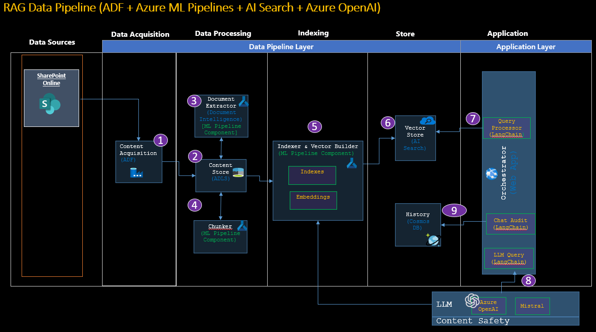
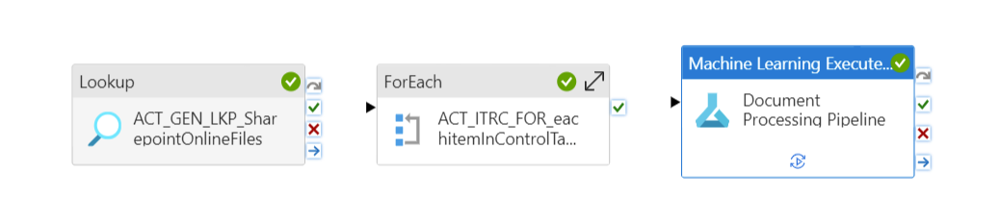
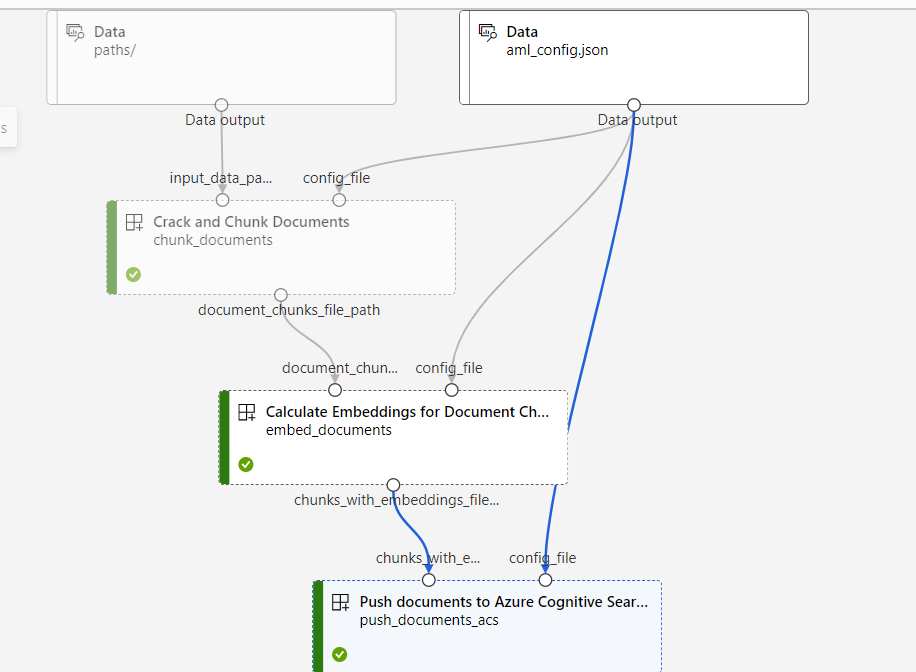
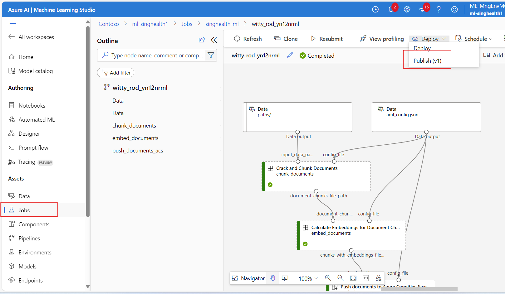
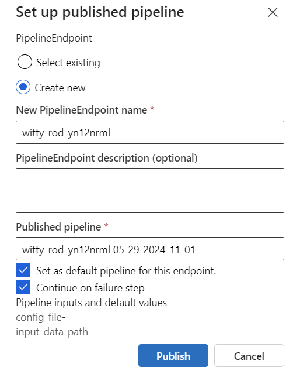
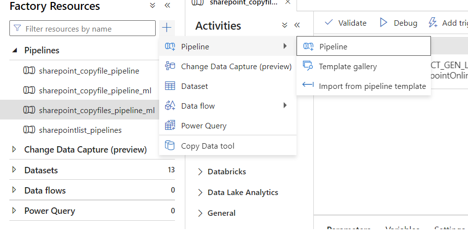
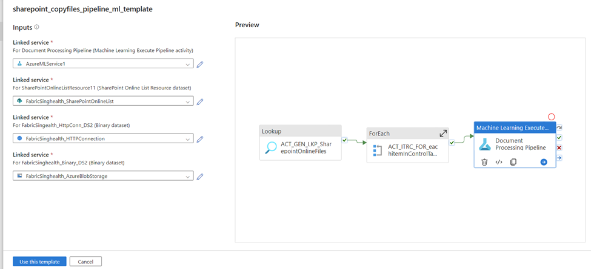
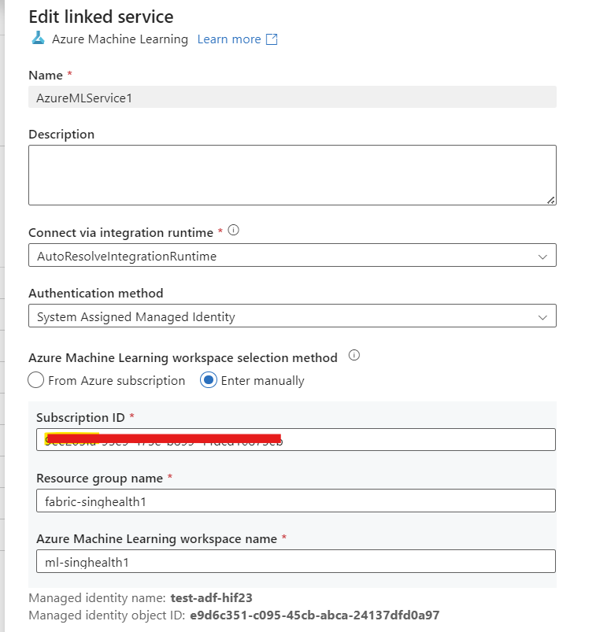
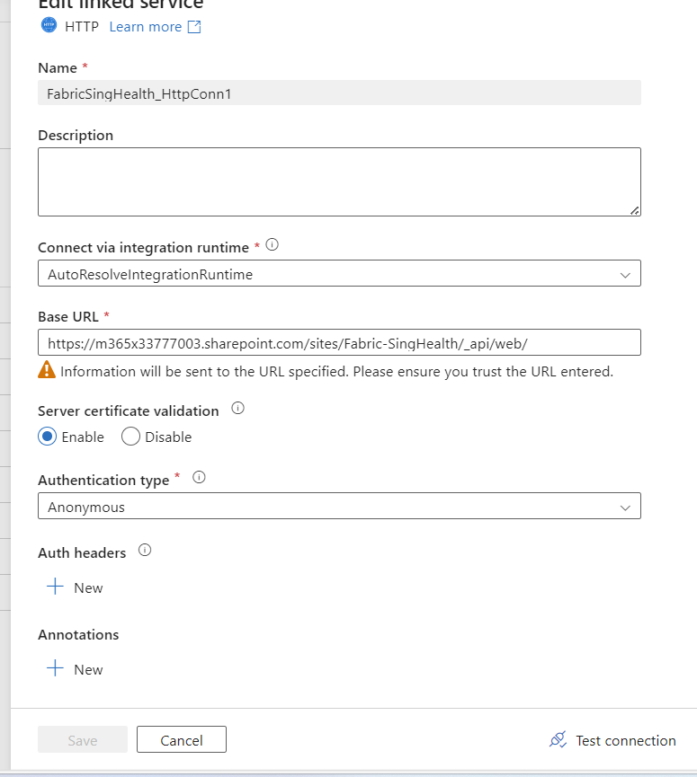
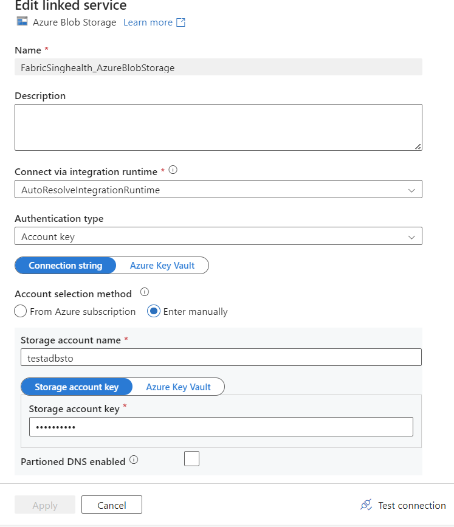

# RAG Data Pipeline using ADF and Azure ML Pipelines
## Features
- **Content Acquisition**: Utilizing Azure Data Factory (ADF) to create a data pipeline that ingests raw files from SharePoint Online Documents into the Data Lake Storage (ADLS)

- **Document Extractor**: Azure ML Pipeline component (Python) applies transformations to raw files extract text, images, tables, OCR using Document Intelligence Service and other enrichments to extract meta data information

- **Chunker**: Azure ML Pipeline component (Python) implements Chunking strategies to process documents of large size, using techniques like structure-based chunking and context-based chunking. 

- **Vector Builder**: Azure ML Pipeline component (Python) to generate vector contents for both text and image descriptions using Azure OpenAI Embedding models. 

- **Indexer**: Azure ML Pipeline component (Python) to perform  indexing of document contents (text and vectors) into AI Search (Vector Store)

## Architecture Diagram



## Data Pipeline Diagram

### ADF Pipeline



### Azure ML Pipeline



## Prerequisites
- Azure Data Factory
- Azure Machine Learning (AML) Workspace
- Azure AI Search resource
- Azure AI Document Intelligence resource
- Azure OpenAI resource with Ada (text-embedding-ada-002) deployment
- Azure Blob Storage account
- Python Version 3.10 or 3.11

## Setup 
- Install the [Azure ML CLI v2](https://learn.microsoft.com/en-us/azure/machine-learning/concept-v2?view=azureml-api-2). Follow steps in [Azure CLI](https://learn.microsoft.com/en-us/cli/azure/install-azure-cli) and then for [ML Extension](https://learn.microsoft.com/en-us/azure/machine-learning/how-to-configure-cli?view=azureml-api-2&tabs=public)
- Setup Venv `python -m venv dev_env`


## Data Pipeline setup
### Setup Azure ML Pipeline

- Configure `aml_config.json`
1. Rename `aml_config.json_template` to `aml_config.json`
2. Set parameters as described in comments
3. Remove comments from file starting with // since JSON parser does not support comments

- Configure AI service keys in env file
1. Rename `env_template` to `.env`
2. Set Keys to AI Services as described in comments (From "Keys and Endpoints" tab of Azure AI Services)

- Configure `datastore.yml`:
    1. Rename `datastore.yml_template` to `datastore.yml`.
    2. Set parameters of Storage account as described in the comments.

- [Optional] Configure the `pipeline.yml` `default_compute` parameter. The default value is set to `azureml:serverless` and can be changed to `azureml:[compute-cluster-name]` for a dedicated cluster.

- Login to azure:
    `az login` (Brower window will open and authenticate using correct subscription)

- Ensure that Azure ML  has access to Blob Storage by going into your storage account > IAM > Add role assignment, and add the permissions to you Azure Identity or ML workspace managed identity:

    1. Storage Blob Data Contributor
    2. Storage Queue Data Contributor


- Create an AML Datastore to connect to Azure Blob Storage. Run the command
```
az ml datastore create --resource-group <workspace resource group> --workspace-name <workspace name> --file datastore.yml
```
Example: az ml datastore create --resource-group "fabric-singhealth1" --workspace-name "ml-singhealth1" --file datastore.yml

- Submit the data processing pipeline job
```
az ml job create --resource-group <workspace resource group> --workspace-name <workspace name> --file pipeline.
```
Example: az ml job create --resource-group "fabric-singhealth1" --workspace-name "ml-singhealth1" --file pipeline.yml

- Verify if the Job is successfuly deployed using "Jobs" menu of Azure ML Studio



- Click on "Publish", Create New Pipeline and Publish



### Setup ADF Pipeline

- Follow steps in https://learn.microsoft.com/en-us/azure/data-factory/connector-sharepoint-online-list?tabs=data-factory#prerequisites to setup service principal authentication with sharepoint

- Follow Steps in https://learn.microsoft.com/en-us/azure/data-factory/connector-sharepoint-online-list?tabs=data-factory#create-a-linked-service-to-a-sharepoint-online-list-using-ui to create Linked Service to Sharepoint Online

- If this error occurred : Failed to get metadata of odata service, please check if service url and credential is correct and your application has permission to the resource. Expected status code: 200, actual status code: Unauthorized, response is : {"error":"invalid_request","error_description":"Token type is not allowed."}.
Follow these steps in https://learn.microsoft.com/en-us/azure/data-factory/connector-troubleshoot-sharepoint-online-list#connection-failed-after-granting-permission-in-sharepoint-online-list to enable ACS.

Example If the sharepoint primary domain name is `M365x33777003.onmicrosoft.com` then tenant name would be `M365x33777003`
1. Connect-SPOService -Url https://`M365x33777003`-admin.sharepoint.com/
2. Set-SPOTenant -DisableCustomAppAuthentication $false

- Import pipeline file to ADF using `Pipelines > Import from pipeline template`


and select `sharepoint_copyfiles_pipeline_ml_template.zip` 



1. Create Linked Service to Azure ML workspace 


2. Select Linked Service to SharePoint Online

3. Create Linked Service to HTTP Connection (this is required to Copy files from Sharepoint)

Base URL : https://[Sharepoint Domain Name]/sites/[Site Name]/_api/web/ . Replace with your sharepoint domain name and site name.

Authentication: Anonymous



4. Create Linked Service to Azure Blob Storage using storage key



- Once Linked Services are setup, click `Use this template' to create pipeline

- Make Configuration changes to Datasets (Under Datasets menu)
1. `FabricSingealth_HttpConn_DS2`: In `Relative URL` 
 @concat('GetFileByServerRelativeUrl(%27/sites/`Fabric-SingHealth`/Shared%20Documents/',dataset().filename,'%27)/$value') Replace `Fabric-SingHealth` with your sitename

 2. `FabricSinghealth_Binary_DS2`: In `File Path` replace `test_storage` with your storage name

- Make configuration changes to Pipeline Activities
`ACT_GEN_WEB_GetBearerToken `inside For Each Loop: 
1. Body: grant_type=client_credentials&client_id=[Client-ID]@[Tenant-ID]&client_secret=[Client-Secret]&resource=00000003-0000-0ff1-ce00-000000000000/[Tenant-Name].sharepoint.com@[Tenant-ID]. 
Replace the client ID (application ID), client secret (application key), tenant ID of Service Principal and tenant name (of the SharePoint tenant).

- Run the ADF Pipeline using `Add Trigger` > `Trigger Now` or create trigger schedule for pipeline https://learn.microsoft.com/en-us/azure/data-factory/how-to-create-schedule-trigger?tabs=data-factory


# Test Local in your laptop

- Create a config file like `config.json`. The format should be a list of JSON objects, with each object specifying a configuration of local data path and target search service and index.

Note: `data_path` can be a path to files located locally on your machine, or an Azure Blob URL, e.g. of the format `"https://<storage account name>.blob.core.windows.net/<container name>/<path>/"`. If a blob URL is used, the data will first be downloaded from Blob Storage to a temporary directory on your machine before data preparation proceeds.

- Activate venv and install requirements.txt
```
dev_env\Scripts\activate
pip install -r requirements.txt
```

- run `python data_preparation.py --config config.json --njobs=4 --form-rec-resource <document intelligence resource name> --form-rec-key <document intelligence resource resource key> --form-rec-use-layout --embedding-model-endpoint <Azure OpenAI Embedding API URL> --embedding-model-key <Azure OpenAI key`

E.g python data_preparation.py --config config_test.json --njobs=1 --form-rec-resource "doc-intelligence-singhealth1" --form-rec-key "xxxxx" --form-rec-use-layout --embedding-model-endpoint "https://test-openai-swe-central1.openai.azure.com/openai/deployments/text-embedding-ada-002/embeddings?api-version=2023-06-01-preview" --embedding-model-key "xxxxx"

# Features Pending for Development
-  Incremental copy of documents from sharepoint and incremental indexing in AI Search using Audit Table in Azure SQLDB for tracking (The current pipeline supports full load, so delete index and recreate index if new documents are added to sharepoint)
- Current Authentication to AI services is key based, refactor code to use managed identities (for deployment in HCC)
- Testing of ML Pipeline using Managed Private VNET setup https://learn.microsoft.com/en-us/azure/machine-learning/how-to-managed-network?view=azureml-api-2&tabs=azure-cli (for deployment in HCC)


