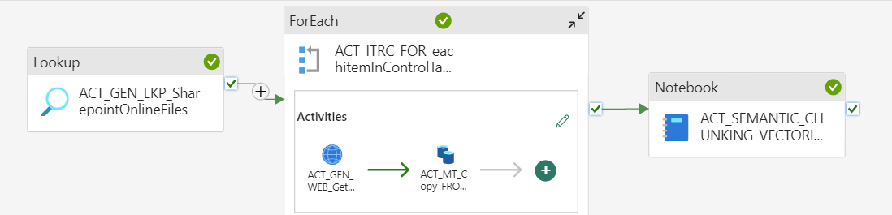
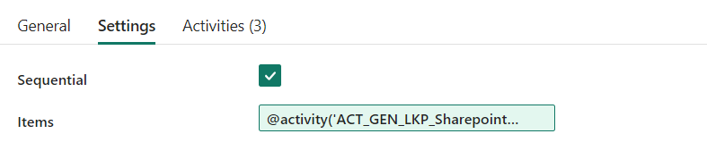

# RAG Data Pipeline using Microsoft Fabric

Microsoft Fabric is an end-to-end analytics SAAS data platform designed for enterprises that require a unified solution. It encompasses data movement, processing, ingestion, transformation, real-time event routing, and report building. It offers a comprehensive suite of services including Data Engineering, Data Factory, Data Science, Real-Time Analytics, Data Warehouse, and Databases


## High Level Architecture


## Workspace Setup

1. Launch Microsoft Fabric Data Engineering experience [Data Engineering](https://app.fabric.microsoft.com/home?experience=data-engineering).
2. Click on `Workspaces` from the left menu and click on `New Workspace` at the bottom of the menu.

    

3. Enter a Workspace Name and click on `Apply`.


    
## Lakehouse Creation

1. Click on `New` from menu and Create new `Lakehouse`


2. Enter a `Lakehouse Name` and click on `Create`.


3. Browse the Lakehouse using explorer 


4. Create two new sub folders **raw** and **processed** using `New subfolder` option


## Import Notebook

1. From `Workspace` select `Import Notebook`


2. Upload notebook `fabric-vectorization-pipeline\Semantic_Chunking_Vectorization.ipynb`

3. The notebook requires Python 3.11 to run. Select` Runtime version 1.3 Public Preview` from `Workspace Settings > Data Engineering/Science > Spark Settings` and click on Save.


## Setup Key Vault

1. Create `Key Vault` service using Azure Portal.

2. Create the follow secrets to access Azure Document Intelligence (DOC-INTELLIGENCE-KEY), Azure OpenAI (AZURE-OPENAI-API-KEY) and Azure AI Search (VECTOR-STORE-PASSWORD) servics keys. Ensure Secret Names are correctly enterted as shown below.


## Create Data Pipeline

1. Create `Data Pipeline` from Workspace and provide name `sharepoint_semantic_vectorization_pipeline`


2. In the Pipeline create the following activities, which we will discuss step by step.

`Main Pipeline`


`ForEach Pipeline`


3. Main Pipeline Activities

a. **Lookup Activity**: Create a Lookup Activity to query Sharepoint Document list

- Follow steps in https://learn.microsoft.com/en-us/fabric/data-factory/connector-sharepoint-online-list-copy-activity#prerequisites to setup service principal authentication with sharepoint

- Enter name and description as below


- From `Settings > Manage Connections and Gateway` create `Sharepoint` connection


Set Sharepoint Site URL : https://[Sharepoint Domain Name]/sites/[Site Name] . Replace with your sharepoint domain name and site name. E.g. https://m365x33777003.sharepoint.com/sites/Fabric-SingHealth/

Select Authentication Mechanism as `Service Principal` and enter Tenant Id, Client Id and Client Secret.

- If this error occurred : Failed to get metadata of odata service, please check if service url and credential is correct and your application has permission to the resource. Expected status code: 200, actual status code: Unauthorized, response is : {"error":"invalid_request","error_description":"Token type is not allowed."}. Follow these steps in https://learn.microsoft.com/en-us/azure/data-factory/connector-troubleshoot-sharepoint-online-list#connection-failed-after-granting-permission-in-sharepoint-online-list to enable ACS.

Example If the sharepoint primary domain name is M365x33777003.onmicrosoft.com then tenant name would be M365x33777003

```
Connect-SPOService -Url https://M365x33777003-admin.sharepoint.com/

Set-SPOTenant -DisableCustomAppAuthentication $false
```

- Set `Settings` as

Select Sharepoint Connection

Set Use Query as `List Name`

Set List Name as `Documents`


b. **ForEach Activity**: Create a ForEach Activity as below

- Enter name and description as below


- In settings, check sequential and enter items as `@activity('ACT_GEN_LKP_SharepointOnlineFiles').output.value`



The activities in ForEach are described in ForEach Pipeline.

4. ForEach Pipeline Activities

a. **Web Activity**: Create Web Activity as below

- Enter name and description as below. Check `Secure Output` option in Advanced Setting


- From `Settings > Manage Connections` and Gateway create `Web V2` connection

```
Set Data Source path to https://accounts.accesscontrol.windows.net/[Tenant Id]/tokens/OAuth/2

Set Authentication to Anonymous
```


- Set `Settings` as

```
Select Web 2 connection

Set Method to `Post`

Set Body to grant_type=client_credentials&client_id=[Client-ID]@[Tenant-ID]&client_secret=[Client-Secret]&resource=00000003-0000-0ff1-ce00-000000000000/[Tenant-Name].sharepoint.com@[Tenant-ID]
Replace the client ID (application ID), client secret (application key), tenant ID of Service Principal and tenant name (of the SharePoint tenant)

Set Headers as Content-Type : application/x-www-form-urlencoded
```


b. **Copy Data activity**: Create Copy Data activity as

- Enter name and description as below. Check `Secure Input option` in Advanced Setting


- From `Settings > Manage Connections` and Gateway create `Web` connection

```
Set URL to `https://`[Sharepoint Domain Name]`/sites/`[Site Name]`/_api/web/` . Replace with your sharepoint domain name and site name

Set Authentication to `Anonymous` and check `Skip Test Connection`
```


- Set `Source` as 

```
Select Web Connection

Set Relative URL to `@concat('GetFileByServerRelativeUrl(%27/sites/[Site Name]/Shared%20Documents/',item().name,'%27)/$value')` Replace `[Site Name]` with your sitename

Set File Format to Binary

Under Advanced Set Request method to `Get` and Additional Headers to `@{concat('Authorization: Bearer ', activity('ACT_GEN_WEB_GetBearerToken').output.access_token)}`

```


- Set Destination as 

```
Set Connection to `Lakehouse Name` created previously

Set Root foler to `Files`

Set File Path to `raw/@item().name`

Set File Format to `Binary`
```


C. **Notebook Activity**: Create Notebook activity as 

- Enter name (ACT_SEMANTIC_CHUNKING_VECTORIZATION) and description as below.


- Set `Settings` as 

```
Set Workspace to Workspace Name previously created

Set Notebook to Notebook (Semantic_Chunking_Vectorization.ipynb) previously created 
```

Set Base Parameters as

| Name | Type | Value|
|----------|----------|----------|
| _inlineInstallationEnabled | Bool  | True | 
| file_name  | String  | @item().name  |
| AZURE_OPENAI_ENDPOINT | String  | URL endpoint for the Azure OpenAI Service  |
| VECTOR_STORE_ADDRESS | String  | URL endpoint for the Azure AI Search Service   |
| EMBEDDING_MODEL  | String  | Embedding Model Deployment Name |
| OPENAI_API_VERSION | String  | 2023-12-01-preview  |
| INDEX_NAME   | String  | Azure AI Search Index Name |
| DOC_INTELLIGENCE_ENDPOINT | String  | URL endpoint for the Azure AI Document Intelligent Service  |

_inlineInstallationEnabled is set to True to enable inline pip installation in notebook


# Run Pipeline and Verify Results

- Run the Data Pipeline using `Run` command https://learn.microsoft.com/en-us/fabric/data-factory/pipeline-runs#on-demand-data-pipeline-run  or use `Schedule` command to schedule pipeline job https://learn.microsoft.com/en-us/fabric/data-factory/pipeline-runs#scheduled-data-pipeline-runs

- Verify if pipeline has sucessfully run using Monitor tab


Verify if OneLake `raw` folder contains documents copied from sharepoint and `processed` folder contains chunks

Verify if AI Search Index is populated with text and vector contents of document chunks

# Reference Documentation 

https://learn.microsoft.com/en-us/fabric/data-factory/connector-sharepoint-online-list-overview

https://learn.microsoft.com/en-us/fabric/data-engineering/library-management

https://learn.microsoft.com/en-us/fabric/data-engineering/author-execute-notebook#designate-a-parameters-cell

https://moaw.dev/workshop/fabric-e2e-rag/?step=3#configure-azure-api-keys

https://github.com/microsoft/Build-your-own-AI-Assistant-Solution-Accelerator/tree/main/Deployment/scripts/fabric_scripts


# Migrate Data pipeline to another tenant

Currently Fabric does not support feature for Export Data Pipeline to template file, Use the repo : https://github.com/rkniyer999/FabricAutomatedDataPipelineDeployment for data pipeline migration.

# Features Pending for Development
-  Incremental copy of documents from Sharepoint to OneLake and incremental indexing in AI Search using Control Table in Fabric SQLDB for tracking new and updated documents (The current pipeline supports full load, so delete index and recreate index if new documents are added to sharepoint)
- Current Authentication to AI services is key based, refactor code to use Managed Identities
- Private Network Setup
